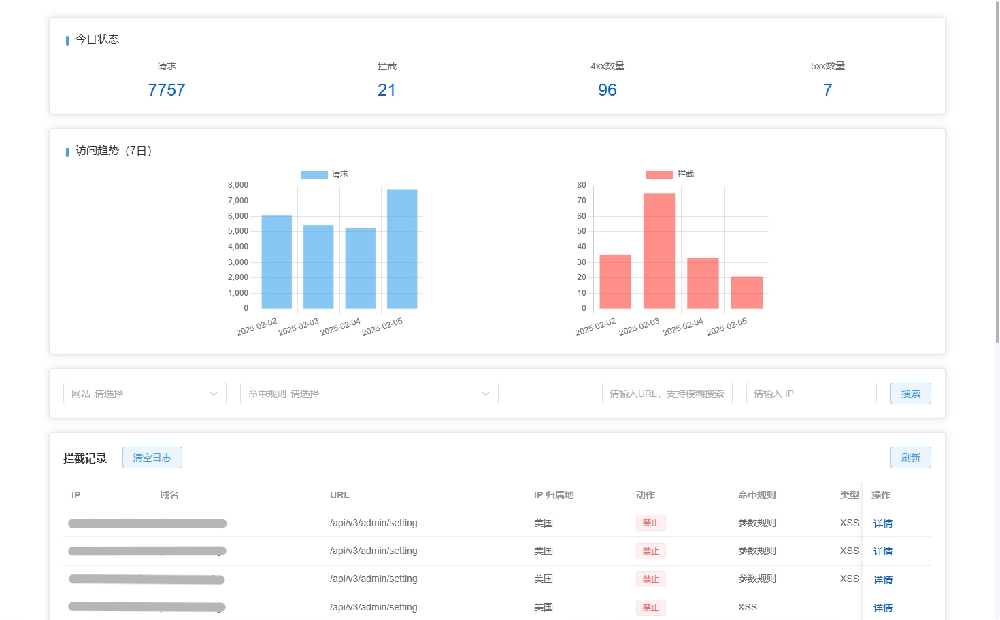
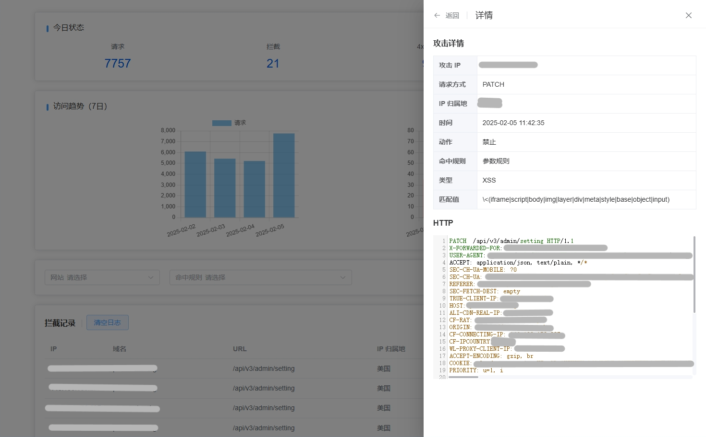

# 1Panel-WAFLogViewer
一个简单的 PHP 工具，允许您在 1Panel 社区版中查看 WAF 日志，而无需专业版。

该项目基于一个开源项目，最初由 Juneha 创建并由 molikaiwork 在这之后进行二次修改。

原文地址：[1panel开心版?之社区版waf日志功能使用](https://blog.mo60.cn/index.php/archives/1panel_waf_log_use.html)

## 预览



## 使用
1. 您需要有一台已经安装了 1Panel 的服务器，并且还安装了 OpenResty；  
此工具更新于 2025/02/05 22:11 UTF+8，当前 1Panel 社区版正式版本最新版本为 v1.10.23-lts，推荐您使用最新的 1Panel 版本。
2. 创建一个用于网站的 PHP 运行环境，  
理论最低支持 PHP 5.1.0 版本，推荐使用 PHP 较新的版本，  
PHP 扩展至少要安装PDO、PDO_SQLITE、JSON；

    如果您完全不懂这是什么，则您可以直接到 1Panel 的 `网站` => `运行环境`，选择 `PHP` 页，然后点击 `创建运行环境` 按钮，  
    名称随意，可以输入 `php7`，  
    然后来源默认，应用选择 `PHP 7`，旁边的版本为 `7.4.33`，  
    镜像默认，PHP 扩展源请根据您的网络环境选择，在中国大陆可以选择 `中国科学技术大学 [mirrors.ustc.edu.cn]`，在其他位置则可以选择 `默认 [dl-cdn.alpinelinux.org]`，  
    扩展模板请选择 `Default`，然后点击 `确认` 按钮即可，等待构建镜像完成。
3. 创建一个网站，选择 `运行环境`，类型选择 `PHP`，运行环境选择您刚刚创建的镜像，如果没有则可能是还没构建完成，  
其他选项请根据实际情况填写，然后点击 `确认` 按钮，完成创建网站。

4. 来到应用商店，选择 `已安装`，找到有您刚刚创建网站时填写的网站名称（代号）相关字样的应用，  
点击 `参数`，然后点击 `编辑`，勾选上 `高级设置`，然后往下找到 `编辑 compose 文件` 并勾选，  
在出现的编辑器的最后一行添加上：
    ```yaml
    - /opt/1panel/apps/openresty/openresty/1pwaf/data/db:/www/db
    ```
    请注意格式，然后点击 `确认`，再点一次 `确认`，这将会开始重建应用，很快就会完成。
5. 在容器页面，找到您创建的网站所属的容器，可靠 `关联资源` 字段来判断容器，  
然后在操作中点击 `终端`，连接终端并输入：
    ```shell
    chmod 777 -R db/
    ```
    完成这一步。
6. 到网站管理页面，找到您刚刚创建的网站，点击操作中的 `配置`，
然后找到 `密码访问`，创建一个用户，请设置一个强大的密码并记住它，点击 `确认`，这将作为您访问网站时的认证，  
将 `是否启用` 开启，完成这一步。

7. 最后是下载[本仓库](https://github.com/molikaiwork/1Panel-WAFLogViewer)中的 `index.html` 和 `api.php` 文件，然后将他们上传到网站目录中即可，完成！  
访问您刚刚创建的网站的域名即可，也不一定需要域名，总之是能在 1Panel 外部访问的渠道。

## 免责声明
该工具 **不会** 绕过或破解任何需要授权的专业版功能，也没有对关于 1Panel 任何版本的源代码修改。它仅是读取已存储但未显示在 1Panel 社区版本中的 WAF 日志。

请确保您使用此工具没有违反任何服务条款。

## License
MIT License. See [LICENSE](LICENSE) for details.
